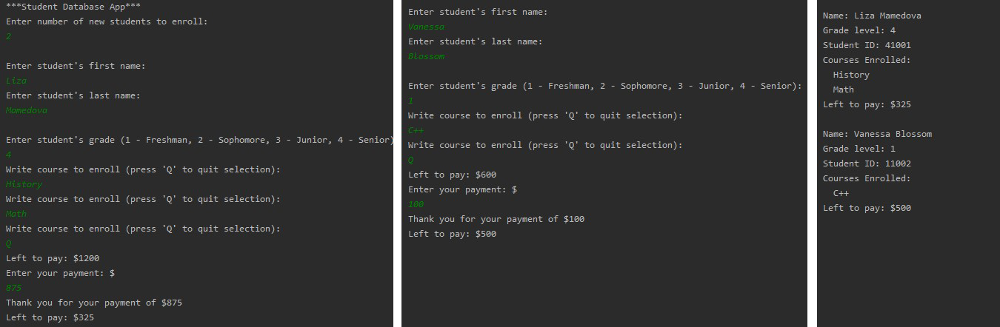

# Student Managment System

**Scenario: You are a Database Administrator for a university and need to create an application to manage student enrollments and balance** 
Application does the following: 
- Ask the user how many new students will be added to the database 
- The user should be prompted to enter the name and year for each student 
- The student should have a 5-digit unique ID, with the first number being their grade level 
- A student can enroll in the courses
- Each course costs $600 to enroll 
- The student able to view their balance and pay the tuition 
- To see the status of the student, we should see their name, ID, courses enrolled, and balance 

